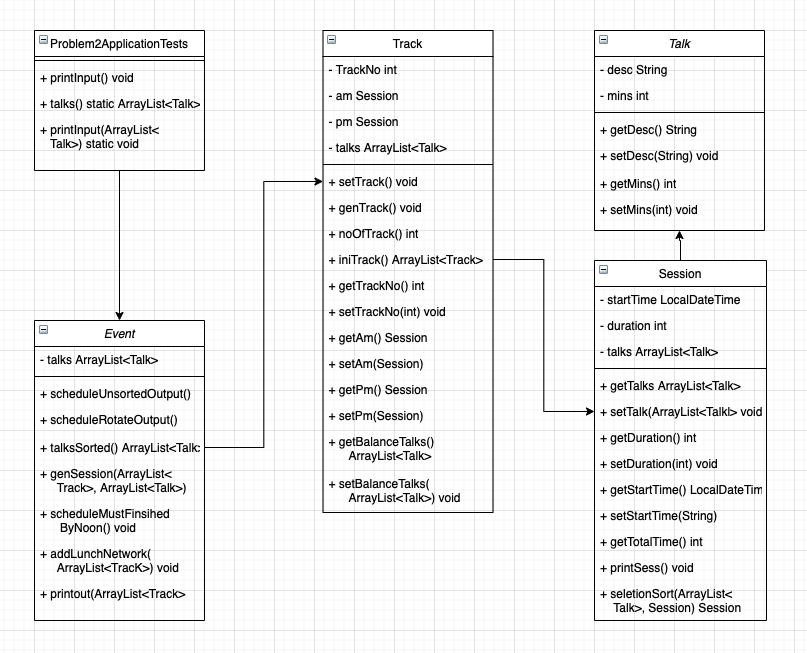
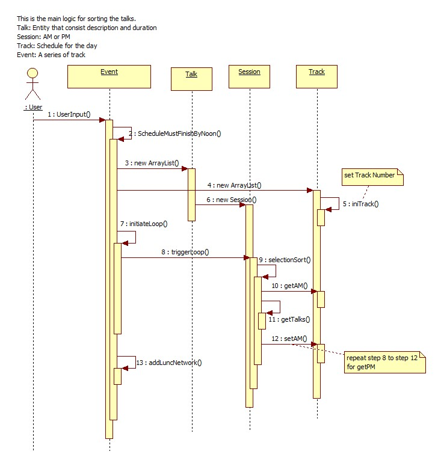
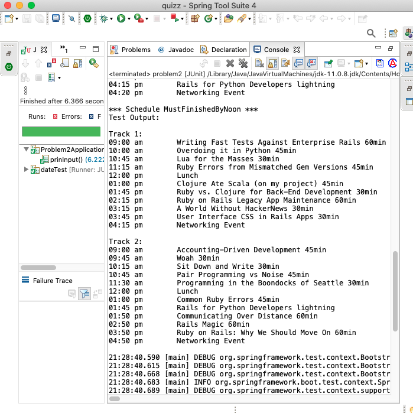

### Problem Two: Conference Track Management
 
You are planning a big programming conference and have received many proposals which have passed the initial screen process but you're having trouble fitting them into the time constraints of the day -- there are so many possibilities! So you write a program to do it for you.
- The conference has multiple tracks each of which has a morning and afternoon session.
- Each session contains multiple talks.
- Morning sessions begin at 9am and must finish by 12 noon, for lunch.
- Afternoon sessions begin at 1pm and must finish in time for the networking event.
- The networking event can start no earlier than 4:00 and no later than 5:00.
- No talk title has numbers in it.
- All talk lengths are either in minutes (not hours) or lightning (5 minutes).
- Presenters will be very punctual; there needs to be no gap between talks.

Test input:

```
Writing Fast Tests Against Enterprise Rails 60min
Overdoing it in Python 45min
Lua for the Masses 30min
Ruby Errors from Mismatched Gem Versions 45min
Common Ruby Errors 45min
Rails for Python Developers lightning
Communicating Over Distance 60min
Accounting-Driven Development 45min
Woah 30min
Sit Down and Write 30min
Pair Programming vs Noise 45min
Rails Magic 60min
Ruby on Rails: Why We Should Move On 60min
Clojure Ate Scala (on my project) 45min
Programming in the Boondocks of Seattle 30min
Ruby vs. Clojure for Back-End Development 30min
Ruby on Rails Legacy App Maintenance 60min
A World Without HackerNews 30min
User Interface CSS in Rails Apps 30min
```

Test output: 

```
Track 1:
09:00AM Writing Fast Tests Against Enterprise Rails 60min
10:00AM Overdoing it in Python 45min
10:45AM Lua for the Masses 30min
11:15AM Ruby Errors from Mismatched Gem Versions 45min
12:00PM Lunch
01:00PM Ruby on Rails: Why We Should Move On 60min
02:00PM Common Ruby Errors 45min
02:45PM Pair Programming vs Noise 45min
03:30PM Programming in the Boondocks of Seattle 30min
04:00PM Ruby vs. Clojure for Back-End Development 30min
04:30PM User Interface CSS in Rails Apps 30min
05:00PM Networking Event
```
``` 
Track 2:
09:00AM Communicating Over Distance 60min
10:00AM Rails Magic 60min
11:00AM Woah 30min
11:30AM Sit Down and Write 30min
12:00PM Lunch
01:00PM Accounting-Driven Development 45min
01:45PM Clojure Ate Scala (on my project) 45min
02:30PM A World Without HackerNews 30min
03:00PM Ruby on Rails Legacy App Maintenance 60min
04:00PM Rails for Python Developers lightning
04:05PM Networking Event
```
---
---
### Class Diagram


### Sequence Diagram for Event.scheduleMustFinsihByNoon
Morning session schedule sorted to finished by noon, for lunch.


### ScreenShot


This application outputs with three different schedules, ie 
* Unsorted Schedule,
* Evenly distributed to sessions Schedule, and
* Finished-by-Noon schedule. 

### JUnit Test
Application execute by run the *test* with data.

Data, outputs shown at [`test/.../Problem2ApplicationTests.java`](/problem2/src/test/java/problem2/Problem2ApplicationTests.java).

---
### Problem2ApplicationTests.java
``` java
	@Test
	public void prinInput() {
		prinInput(talks());

		var event = new Event(talks());
		
		System.out.println("\n*** Schedule Unsort ***");
		event.scheduleUnsortedOutput();

		System.out.println("\n*** Schedule Rotate Distributing ***");
		event = new Event(talks());
		event.scheduleRotateOutput();
		
		System.out.println("\n*** Schedule MustFinishedByNoon ***");
		event = new Event(talks());
		event.scheduleMustFinishedByNoon();	
		
		System.out.println("");
	}
	
	private static ArrayList<Talk> talks() {
		Talk[] talkArray = {
				new Talk( "Writing Fast Tests Against Enterprise Rails 60min", 60 ),
				new Talk( "Overdoing it in Python 45min",45 ),
				...
```
The following are three class objects for Finished-By-Noon output:
### Event.java
``` java
public class Event {
	private static ArrayList<Talk> talks;
	
	public Event(ArrayList<Talk> talks) {
		super();
		Event.talks = talks;
	}
	...
	/* MustFinishedByNoon output */
	public void scheduleMustFinishedByNoon() {

		Track trackList = new Track(talks);
		ArrayList<Track> allTracks = trackList.iniTrack();
		
		var sessSorting = new Session(talks);
		
		// sort on morning session, must before noon
		for (var tk: allTracks) {
			Session sessAm = tk.getAm();
			sessAm = sessSorting.selectionSort(sessSorting.getTalks(), sessAm);
			tk.setAm(sessAm);
		}
		
		// sort on afternoon session
		for (var tk: allTracks) {
			Session sessPm = tk.getPm();
			sessPm = sessSorting.selectionSort(sessSorting.getTalks(), sessPm);
			tk.setPm(sessPm);
		}	
		
		addLunchNetwork(allTracks);
		printout(allTracks);
	}
```
### Track.java
``` java
public class Track {
	private int TrackNo;
	private Session am;
	private Session pm;
	private ArrayList<Talk> talks;
	public Track() {
		super();
	}
	public Track(ArrayList<Talk> talks) {
		super();
		this.talks = talks;
	}
	...
	/* Instantiate Track and Sessions */
	public ArrayList<Track> iniTrack() {
		var allTracks = new ArrayList<Track>();
		for (var i = 1 ; i <= noOfTrack() ; i++) {
			var t = new Track();
			t.setTrack();
			t.setTrackNo(i);
			allTracks.add(t);
		}
		return allTracks;
	}
```
### Session.java
``` java
public class Session {

	private LocalDateTime startTime;
	private int duration;
	private ArrayList<Talk> talks;
	
	public Session() {
		super();
	}
	public Session(ArrayList<Talk> talks) {
		super();
		this.talks = talks;
	}
	...
	/* for MustFinishedByNoon, using Selection Sort */ 
	public Session selectionSort(ArrayList<Talk> tk, Session sess) {
		var balTalks = new ArrayList<Talk>();
		var temp = new ArrayList<Talk>();
		var sessTalks = sess.getTalks();
		int sessDura = sess.getDuration();
		
		do {
			sessTalks.clear();
			temp.clear();
			
			for (var t : tk) {
				if ((sess.getTotalTime() + t.getMins() ) <= sessDura) {
					sessTalks.add(t);}
				else temp.add(t);
			}
			
			if ((sess.getTotalTime() != sessDura) && (temp.size() > 0) ) {
				balTalks.add(tk.get(0));
				tk.remove(0);
			}
		} while ((sess.getTotalTime() != sessDura) && (temp.size() > 0) );
		
		for (var t : temp) {
			balTalks.add(t);
		}
		
		setTalks(balTalks);
		return sess;
	}	
```
